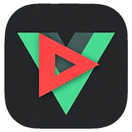

# VueTube

自前サーバー上の動画を手軽に閲覧・再生できる、プライベート動画ストリーミングアプリ



## 概要

VueTube は、自分のウェブサーバーにアップロードした動画ファイルをブラウザやAndroidアプリから閲覧・再生するためのアプリです。  
サーバー側はPHPスクリプト、クライアント側はVue 3 + Vuetify 3で構築されており、Capacitorを使ってAndroidアプリとしてもビルドできます。

## 主な機能

- 🔐 ユーザーID・パスワードによる認証
- 📋 サーバー上の動画ファイル一覧表示
- 🔍 ファイル名での絞り込み検索
- 🔀 名前・サイズ・ランダムによる並び替え
- ▶️ ブラウザ内でのMP4動画再生
- ⏩ 10秒スキップ・フルスクリーン対応
- 📤 動画ファイルのダウンロード・共有
- 💾 ログイン情報・検索状態のローカル保存
- 📱 Capacitorを用いたAndroidアプリ対応

## ファイル構成

```
VueTube/
├── php/                    # サーバー側PHPスクリプト
│   ├── main.php            # 動画ファイル一覧取得API（認証含む）
│   └── userlist.php        # ユーザー一覧（要作成）
├── src/                    # Vueフロントエンドソース
│   ├── pages/
│   │   ├── login.vue       # ログインページ
│   │   ├── index.vue       # ファイル一覧ページ
│   │   └── player.vue      # 動画再生ページ
│   ├── stores/
│   │   └── store.ts        # Piniaグローバルストア
│   └── main.ts             # エントリーポイント
├── android/                # Capacitor Androidプロジェクト
├── public/                 # 静的ファイル（アイコン等）
├── capacitor.config.ts     # Capacitor設定
├── vite.config.mts         # Vite設定
└── package.json
```

## 動作要件

- **サーバー側**: PHPが動作するウェブサーバー（Apache/Nginxなど）
- **クライアント側（Web）**: モダンブラウザ（Chrome / Firefox / Safari）
- **クライアント側（Androidアプリビルド）**: Node.js、Android Studio

## セットアップ

### サーバー側の設定

1. `php/` フォルダの中身をウェブサーバーにアップロード

2. アップロード先に動画ファイルを格納するディレクトリを作成し、再生したい動画ファイル（MP4）を格納  
   ※ デフォルトでは `hoge/` というディレクトリ名になっています。`main.php` の `$directoryPath` を変更することで任意のパス名に変更可能です

3. 以下の内容で `php/userlist.php` を作成し、アクセスを許可するユーザーを設定

```php
<?php
$userList = [
  [
    'userId' => 'user001',
    'password' => 'password001'
  ],
  [
    'userId' => 'user002',
    'password' => 'password002'
  ],
];
```

4. Apacheを使用している場合は、以下の内容の `.htaccess` をPHPフォルダと同じディレクトリに配置

```htaccess
# 外部からのAPIへのアクセスを許可
Header set Access-Control-Allow-Origin: "*"

Options -Indexes
IndexIgnore *
```

### クライアント側のセットアップ

依存パッケージをインストールします：

```bash
yarn install
```

開発サーバーを起動します（[http://localhost:3000](http://localhost:3000) でアクセス可能）：

```bash
yarn dev
```

本番用ビルドを作成します：

```bash
yarn build
```

### Androidアプリとしてビルドする場合

1. 本番ビルドを作成

```bash
yarn build
```

2. AndroidプロジェクトにWebアセットをコピー

```bash
npx cap sync android
```

3. Android Studioで `android/` フォルダを開き、デバイスまたはエミュレーターにインストール

## テスト用ログイン情報

以下の情報でログインすると、テスト用サーバーに接続してミュージックビデオを再生できます。  
※ これは動作確認用の公開テスト環境です。利用できるリソースには制限があります。

- **ユーザーID**: test
- **パスワード**: test
- **接続先サーバー**: https://mikel.enoki.xyz

## 📑 ライセンス

[MIT](http://opensource.org/licenses/MIT)
